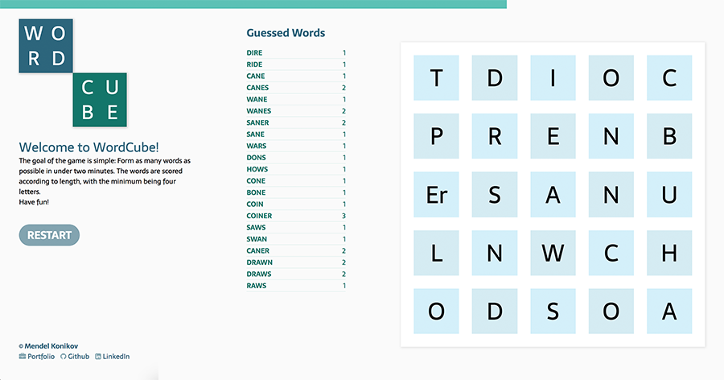

# WordCube

WordCube is a fun word game built with vanilla JavaScript. The goal of the game is to formulate as many words as possible using variations of the letters that appear on the 5x5 grid in under 120 seconds. Score is calculated based on length of words formulated (minimum four letters).

[Click here](http://mkonikov.com/WordCube) to play.



## Implementation

The game was created with multiple classes each handling their own distinct parts of the game interfacing with each other in a standard object-oriented fashion.

The `Game` class controls the entire game, passing on responsibilities to tthe `Cube` and `Timer` class to kick off the game.

A `Dice` class returns a new rolled dice each time using the official Big Boggle dice and letter count.

```
static rollDice() {
  const diceArrays = [....];
  let i;
  let j;
  let temp;

  for (i = diceArrays.length - 1; i > 0; i -= 1) {
    j = Math.floor(Math.random() * (i + 1));
    temp = diceArrays[i];
    diceArrays[i] = diceArrays[j];
    diceArrays[j] = temp;
  }

  return diceArrays;
}
```

When each tile is created, the `Cube` class keeps track of the DOM nodes in an object with the position as its key. Each rendered `<li>` DOM node contains a data attribute with its position, and when selected, the `Cube` class can easily retrieve the DOM node from the POJO using the data attribute as key.

 An event handler tracks the click of the mouse indicating the beginning and end of a selection while a mouseover event handler adds additional letters to the selection.

 After a letter is hovered over, the `Selection` class checks to see if it is a valid move by ensuring that a) this letter was not hovered during this selection, b) this letter is touching the previous letter on of of its eight sides by calculating all the diffs and ensuring it's one of the legal game plays and c) that this letter is the not the same as the previous letter in the selection.

```
checkMove(letter) {
  if (this.letters.length < 1) {
    return true;
  }

  const last = this.letters.length - 1;
  const diff = letter.calcDiff(this.letters[last]);
  const actuallyMoved = diff !== [0, 0];
  const xNeighbor = [-1, 0, 1].includes(diff[0]);
  const yNeighbor = [-1, 0, 1].includes(diff[1]);
  const pastPos = this.letters.some(el => letter.samePosition(el));
  if (actuallyMoved && !pastPos &&
    xNeighbor && yNeighbor) {
    return true;
  } else {
    return false;
  }

}
```
Once the move is validated the letter is added to the selection.

Once a player clicks on the final letter and is ready to submit a word a static method on the `Word` class is called to check if the word is a valid submission, `validWord(word, prevGuesses)`, checking firstly to see if the guess was previously made during this round.

If this is a unique guess the guess will then be checked against the dictionary of some 70,000 words to see if it is a valid word.

For maximum speed and efficiency the dictionary is checked with a binary search to achieve O(log n) complexity.

```
static searchDictionary(dictionary, word) {
  if (dictionary.length < 1) return false;

  const midpoint = Math.floor(dictionary.length / 2);

  if (dictionary[midpoint] === word) {
    return true;
  } else if (dictionary[midpoint] > word) {
    return this.searchDictionary(dictionary.slice(0, midpoint), word);
  } else {
    return this.searchDictionary(dictionary.slice(midpoint + 1), word);
  }

  return false;
}
```
Once validated the selection is then passed to a new instance of the `Word` class which calculate the value based on the length of the word and lists the word and score.

A timer is running with a `setInterval` throughout that ends the game after two minutes with an option to restart.

## Future Improvements

- [ ] List all possible words after round is complete
- [ ] List high scores
