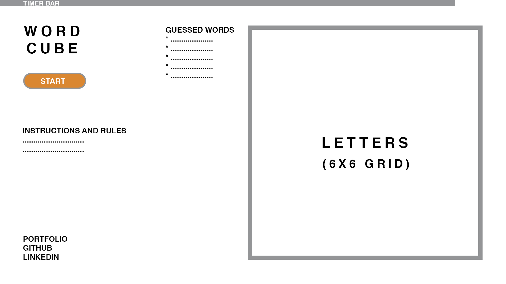

# WordCube

## About

WordCube is a fun word game where players must formulate as many words as possible using variations of the letters that appear on a the 5x5 grid in under 120 seconds. Score is calculated based on length of words formulated (minimum four letters).

## Functionality & MVP

- [ ] Start and reset game, populating board with new letters
- [ ] Time game and end after 90 seconds
- [ ] Select letters to formulate words
- [ ] Validate words with dictionary
- [ ] Calculate score and list guessed words

## Wireframe

The game will be rendered on a single page with controls to start and reset game. Guessed words will be listed alongside the board. Letters will be selected by initially clicking on the first letter and dragging the mouse until word is complete.

## Technologies

The project will be implemented using HTML, CSS, and vanilla JavaScript, with webpack to bundle the JS files.

## Implementation Timeline

**Day 1**: Setup webpack and rest of project skeleton. Setup randomized board for every new round.

Goals for the day:

- Setup skeleton
- Handle user selection based on mouse click
- Setup timer

**Day 2**: Generate random board with varying letter counts based on dictionary. Validate words and score based on length.

Goals for the day:
- Generate random board with letter count based on dictionary averages
- Validate words against dictionary

**Day 3**: Complete game with score, instructions and possible focus on bonuses.

Goals for the day:

- Score words based on length
- Style game
- Add instructions

## Bonus features

- [ ] List all possible words after round is complete
- [ ] List highscores
